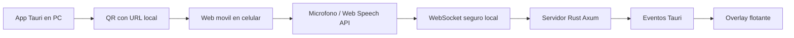

# AIEP Subtitulos

App de escritorio inclusiva para docentes: muestra subtitulos flotantes sobre cualquier presentacion, navegador o aplicacion. El celular funciona como microfono y el PC muestra el texto como overlay.

Este repositorio contiene un MVP funcional construido con Tauri, TypeScript y Rust.

## Que hace

- Abre una app de escritorio en el PC.
- Muestra un QR para conectar el celular.
- Sirve una web movil local por HTTPS.
- Usa el reconocimiento de voz del navegador del celular.
- Envia texto al PC por WebSocket.
- Muestra subtitulos en una ventana flotante always-on-top.
- Permite mostrar, ocultar, cerrar, mover y reposicionar el overlay.
- Puede usar Cloudflare Tunnel para que el celular no tenga que estar en la misma red.
- Guarda localmente un registro de lo transcrito y permite descargarlo como TXT.

## Estado del MVP

La version actual prioriza tener el flujo completo funcionando con baja friccion.

Importante:

- El modo recomendado es Cloudflare Tunnel si `cloudflared` esta instalado.
- Si Cloudflare Tunnel no esta disponible, la app usa modo red local.
- No se guarda audio ni texto por defecto.
- En esta version el audio no se envia al PC: el celular transcribe con Web Speech API y envia texto.
- El overlay es una ventana Tauri transparente, flotante y movible.
- La web movil usa HTTPS local con certificado autofirmado; el celular debe aceptar la advertencia del navegador.

## Requisitos

- Windows 10/11.
- Node.js 20 o superior.
- npm 10 o superior.
- Rust y Cargo instalados.
- WebView2 Runtime instalado, normalmente ya viene con Windows moderno.
- Un celular conectado a la misma red local que el PC.
- Chrome en Android recomendado para reconocimiento de voz web.
- `cloudflared` opcional para enlaces publicos sin estar en la misma red.

Puedes revisar versiones con:

```powershell
node --version
npm --version
rustc --version
cargo --version
```

## Instalacion

Clona el repositorio e instala dependencias:

```powershell
git clone https://github.com/Dieg0Code/aiep-subtitulos.git
cd aiep-subtitulos
npm install
```

### Instalar cloudflared opcional

Para usar el modo de enlace publico instala Cloudflare Tunnel CLI (`cloudflared`) y asegurate de que el comando quede disponible en el `PATH`.

En Windows puedes instalarlo desde la documentacion oficial de Cloudflare:

https://developers.cloudflare.com/cloudflare-one/connections/connect-networks/downloads/

Luego verifica:

```powershell
cloudflared --version
```

## Ejecutar en desarrollo

```powershell
npm run tauri dev
```

Esto levanta:

- Vite en `http://localhost:1420`.
- La app Tauri de escritorio.
- Un servidor movil local en `https://<ip-del-pc>:8787`.
- Un servidor HTTP interno en `http://127.0.0.1:8788` para Cloudflare Tunnel.

La primera compilacion de Rust/Tauri puede tardar varios minutos.

## Uso

1. Abre la app con `npm run tauri dev`.
2. Elige el modo de conexion:
   - `Enlace publico Cloudflare`: recomendado si el celular puede estar fuera de la red.
   - `Red local`: fallback privado dentro de la misma red.
3. En la ventana principal, escanea el QR con el celular.
4. En el celular, acepta permisos de microfono.
5. Presiona `Iniciar subtitulos`.
6. Habla cerca del celular.
7. El texto aparecera en la vista previa, en el registro y en el overlay flotante.

## Modos de conexion

### Enlace publico Cloudflare

La app ejecuta:

```powershell
cloudflared tunnel --url http://127.0.0.1:8788
```

Cloudflare entrega una URL `https://*.trycloudflare.com`, y el QR se actualiza automaticamente.

Ventajas:

- El celular puede estar en datos moviles u otra red.
- El navegador ve HTTPS valido.
- Evita la advertencia de certificado autofirmado.

Consideraciones:

- El trafico pasa por infraestructura de Cloudflare.
- La URL es temporal.
- Requiere tener `cloudflared` instalado.

### Red local

La app usa:

```text
https://<ip-del-pc>:8787
```

Ventajas:

- No depende de servicios externos.
- El trafico queda en la red local.

Consideraciones:

- PC y celular deben estar en la misma red.
- Puede aparecer advertencia HTTPS por certificado autofirmado.
- Algunas redes institucionales bloquean comunicacion entre dispositivos.

## Controles del overlay

Desde la ventana principal:

- `Mostrar overlay`: muestra o recrea el overlay.
- `Ocultar`: oculta el overlay.
- `Enviar abajo`: vuelve a posicionarlo abajo, respetando el area util del monitor.

Desde el overlay:

- Arrastra el bloque negro para moverlo.
- Pasa el mouse sobre el overlay para ver controles.
- `Pausar`: congela los subtitulos.
- `Tamano`: cambia el tamano del texto.
- `X`: oculta el overlay.

## Registro de transcripcion

La app puede guardar localmente lo que se va diciendo.

- El registro queda en `localStorage` de la webview Tauri.
- No se sube automaticamente a ningun servidor.
- Puedes desactivar `Guardar lo transcrito en esta app`.
- Puedes descargar el registro como archivo `.txt`.
- Puedes limpiar el registro desde la app.

## Build

Compilar frontend:

```powershell
npm run build
```

Verificar Rust:

```powershell
cd src-tauri
cargo check
```

Construir instalador/app de escritorio:

```powershell
npm run tauri build
```

Los artefactos se generan dentro de `src-tauri/target`.

## Solucion de problemas

### El celular no abre el QR

Revisa:

- PC y celular en la misma red WiFi.
- El celular no esta usando datos moviles.
- El firewall de Windows permite conexiones al puerto `8787`.
- La red no tiene aislamiento de clientes.

Si quieres evitar esos requisitos, usa `Enlace publico Cloudflare`.

### Cloudflare no inicia

Revisa:

- `cloudflared --version` funciona en PowerShell.
- El puerto local `8788` no esta ocupado.
- Tu conexion permite abrir tuneles salientes.

### El navegador bloquea el microfono

La web movil usa HTTPS local con certificado autofirmado. Debes aceptar la advertencia del navegador. Chrome en Android suele funcionar mejor para Web Speech API.

### El overlay no aparece

Usa `Mostrar overlay` en la ventana principal. Si aparece fuera de lugar, usa `Enviar abajo`.

### El overlay no se mueve

Arrastra el bloque negro del subtitulo, no los botones. El bloque usa la API `startDragging` de Tauri.

### Las palabras se repiten

El MVP incluye limpieza de repeticiones, pero Web Speech API puede devolver frases parciales crecientes. La ruta tecnica recomendada para mejorar esto es enviar audio al PC y transcribir con `whisper.cpp`, `faster-whisper` u OpenAI.

## Arquitectura



## Estructura

- `src/main.ts`: UI principal, overlay y eventos Tauri.
- `src/styles.css`: estilos de la app y subtitulos.
- `src-tauri/src/lib.rs`: servidor HTTPS local, WebSocket, comandos Tauri y posicionamiento del overlay.
- `src-tauri/tauri.conf.json`: configuracion de ventanas Tauri.
- `src-tauri/capabilities/default.json`: permisos Tauri.

## Privacidad

Por defecto:

- No se guarda audio.
- No se envia audio a la nube.
- La transcripcion se guarda localmente solo si la opcion esta activa.
- En modo red local, la comunicacion ocurre entre celular y PC.
- En modo Cloudflare, el trafico pasa por Cloudflare Tunnel.

El punto debil actual es que Web Speech API puede depender del navegador/proveedor. Para una version de privacidad fuerte, la siguiente etapa debe mover la transcripcion al PC con un motor local.

## Roadmap

- Streaming de audio desde celular hacia PC con WebRTC o WebSocket.
- Transcripcion local con `whisper.cpp` o `faster-whisper`.
- Opcion de proveedor nube configurable.
- Guardar preferencias locales de posicion, tamano y opacidad.
- Mejor flujo de certificado local para evitar advertencias HTTPS.
- Empaquetado instalable para docentes no tecnicos.

## Licencia

MIT.
