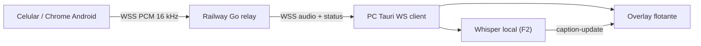

# AIEP Subtitulos

App de escritorio inclusiva para docentes: muestra subtitulos flotantes sobre cualquier presentacion, navegador o aplicacion. El celular funciona como microfono y el PC muestra el texto como overlay siempre visible.

El audio del celular viaja al PC a traves de un relay WebSocket publico en Railway, asi no importa si el celular esta en otra red o usando datos moviles. No requiere instalar `cloudflared`, no muestra advertencias de certificado y no depende de la red local.

Repositorio con dos componentes: **app de escritorio Tauri** (frontend + Rust) y **relay Go** desplegado en Railway.

## Descarga (instalador Windows)

La forma recomendada de usar la app es bajar el instalador desde la pagina de [Releases](https://github.com/Dieg0Code/aiep-subtitulos/releases/latest). Doble click al `.exe`, siguiente-siguiente-listo.

**Primera vez / SmartScreen**: Windows puede mostrar "Windows protegio tu PC" porque el instalador no esta firmado digitalmente y la app aun tiene poca reputacion de descarga. En esa pantalla haz click en **Mas informacion** -> **Ejecutar de todas formas**. Esto es normal en proyectos piloto sin certificado de firma de codigo.

Para eliminar esa advertencia de forma real habria que firmar el instalador con un certificado de code signing (idealmente EV para reputacion SmartScreen inmediata) o distribuir la app por una tienda/plataforma con confianza de Microsoft. No se puede desactivar desde el codigo de la app sin firmar el ejecutable.

**Requisitos**: Windows 10/11 64-bit. WebView2 viene incluido en Windows 11 y en Windows 10 desde el April 2018 Update; si falta, el instalador lo descarga. Necesitas internet para el relay.

El resto de este README es para desarrolladores. Si solo quieres usar la app, con el instalador es suficiente.

## Que hace

- Abre la app de escritorio en el PC.
- Se conecta al relay y obtiene un ID de sesion.
- Muestra un QR con la URL del celular: `https://aiep-relay-production.up.railway.app/m?s=<id>`.
- El celular abre esa URL (HTTPS valido), pide permiso de microfono y empieza a enviar audio.
- El PC recibe audio PCM 16 kHz en vivo y mantiene un contador para verificar el flujo.
- Muestra el overlay flotante always-on-top con los subtitulos generados por Whisper local cuando el modelo esta instalado.
- Permite mostrar, ocultar, cerrar, mover y reposicionar el overlay.
- Guarda localmente un registro de lo transcrito y permite descargarlo como TXT.

## Estado del MVP

Esta version logra el flujo completo de captura, transporte y transcripcion local cuando el modelo esta instalado:

- F1 cerrado: celular captura audio y lo envia en chunks binarios al relay, el relay lo forwardea al PC. Se observa con el contador `Audio recibido: X KB en N chunks`.
- F2 simple: `whisper-rs-sys` corre en el PC con CPU y modelo `ggml-base.bin`. Si falta el modelo, la app lo descarga automaticamente y el celular cae a reconocimiento web como respaldo mientras termina.
- F3 pendiente: ventana deslizante / interim captions.

Importante:

- No se guarda audio en ningun lado (ni PC, ni relay).
- El audio pasa por el relay en transito (PCM 16 kHz en WebSocket cuando Whisper esta activo). No se almacena.
- El overlay es una ventana Tauri transparente, flotante y movible.

## Requisitos

- Windows 10/11.
- Node.js 20 o superior, npm 10 o superior.
- Rust y Cargo instalados. Para compilar Whisper en Windows se recomienda toolchain MSVC (`x86_64-pc-windows-msvc`).
- CMake instalado y disponible en `PATH` para compilar `whisper.cpp`.
- `libclang` visible para bindgen de `whisper-rs-sys`. En Windows local puede ser MSYS2 clang (`LIBCLANG_PATH=C:\msys64\mingw64\bin`) o LLVM.
- WebView2 Runtime (suele venir con Windows moderno).
- Conexion a internet (el relay vive en Railway y el primer arranque descarga el modelo Whisper si falta).
- Un celular con Chrome en Android (o Safari iOS) para escanear el QR.

```powershell
node --version
npm --version
rustc --version
cargo --version
cmake --version
```

## Instalacion

```powershell
git clone https://github.com/Dieg0Code/aiep-subtitulos.git
cd aiep-subtitulos
npm install
```

El relay Go se instala aparte solo si quieres modificarlo localmente; ver `server/README.md`.

## Ejecutar en desarrollo

```powershell
npm run tauri dev
```

Levanta:

- Vite en `http://localhost:1420` (UI Tauri).
- La app de escritorio Tauri.
- Cliente WebSocket conectado a `wss://aiep-relay-production.up.railway.app/ws/host`.

La primera compilacion de Rust toma varios minutos.

## Uso

1. Abre la app con `npm run tauri dev`.
2. Si falta `ggml-base.bin`, espera la descarga automatica del modelo (~141 MB). Mientras baja, el QR usa reconocimiento web del celular como respaldo.
3. Espera el QR (1-2 segundos despues de conectar al relay).
4. Escanea el QR con el celular.
5. En el celular acepta permisos de microfono.
6. Presiona "Iniciar captura".
7. Habla cerca del celular.
8. En la app del PC el contador "Audio recibido" sube y el chip de estado dice "Celular conectado".

Si pierdes la conexion, el cliente Tauri reintenta con backoff exponencial y, al reconectar, obtiene un nuevo session ID; el QR se regenera y debes volver a escanearlo en el celular.

## Configuracion

| Variable | Default | Notas |
|---|---|---|
| `AIEP_RELAY_URL` | `https://aiep-relay-production.up.railway.app` | URL base del relay. La app deriva `wss://.../ws/host` y construye la URL movil `<base>/m?s=<id>`. Util para apuntar a un relay staging o local. |
| `RUST_LOG` | `info` | Nivel de log Rust (`tracing_subscriber`). Usa `debug` o `trace` para diagnosticar problemas del cliente WS. |

Modelo Whisper:

```powershell
# La app descarga automaticamente ggml-base.bin si falta.
# Ruta final esperada:
$env:APPDATA\cl.aiep.subtitulos\models\ggml-base.bin
```

Ejemplo Powershell:

```powershell
$env:AIEP_RELAY_URL = "http://127.0.0.1:8080"
$env:RUST_LOG = "debug"
npm run tauri dev
```

## Controles del overlay

Desde la ventana principal:

- "Mostrar": muestra o recrea el overlay.
- "Ocultar": oculta el overlay.
- "Abajo": reposiciona el overlay en la parte inferior del monitor primario.

Desde el overlay:

- Arrastra el bloque negro para moverlo.
- Pasa el mouse sobre el overlay para ver controles.
- "Pausar": congela los subtitulos.
- "Tamano": cambia el tamano del texto.
- "X": oculta el overlay.

## Registro de transcripcion

- El registro queda en `localStorage` del webview Tauri.
- Solo se llena cuando el celular envia texto via "Modo respaldo escrito" (textarea manual). El audio capturado se almacena en ninguna parte.
- Puedes desactivar "Guardar lo transcrito en esta app" en Opciones.
- Puedes descargar el registro como `.txt` o limpiarlo desde la app.

## Build

```powershell
npm run build              # frontend Vite + tsc
cd src-tauri; cargo check  # validar Rust
npm run tauri build        # instalador/app de escritorio
```

Artefactos en `src-tauri/target/release/bundle/`.

## Arquitectura



Protocolo del relay (`server/main.go`, `server/hub.go`):

- **Host** (Tauri PC) conecta a `wss://<relay>/ws/host`. El relay responde con `{"type":"session","id":"ABC123"}` y forwardea todos los frames que llegan del guest.
- **Guest** (celular) conecta a `wss://<relay>/ws/guest?s=<id>`. El relay forwardea binario (PCM para Whisper o texto JSON del respaldo web) al host. Al parear / despareceer, el relay inyecta al host `{"type":"status","state":"phone-connected|phone-disconnected"}`.

Ver `server/README.md` para el detalle del relay.

## Estructura

- `src/main.ts`: UI principal y overlay, listeners de eventos Tauri.
- `src/styles.css`: estilos.
- `src-tauri/src/lib.rs`: bootstrap Tauri, comandos del overlay, monta el cliente del relay.
- `src-tauri/src/relay.rs`: cliente WebSocket, reconexion exponencial, heartbeat 30s, ruteo de frames a eventos Tauri y audio PCM a Whisper.
- `src-tauri/src/whisper.rs`: carga `ggml-base.bin`, transcribe ventanas PCM cortas con `whisper-rs-sys`, y emite `caption-update`.
- `src-tauri/tauri.conf.json`: ventanas Tauri (`main` y `overlay`).
- `server/`: codigo Go del relay (deploy Railway, tests, Dockerfile).
- `.github/workflows/relay-ci.yml`: CI del relay (vet + test -race + build).

## Privacidad

- No se guarda audio en disco ni en PC ni en el relay.
- El audio pasa por el relay (Railway, region `us-east`) en transito como WebSocket binario PCM cuando Whisper esta activo. No se persiste.
- La transcripcion del modo respaldo escrito se guarda localmente solo si la opcion esta activa.
- Los logs del relay registran metadata (timestamps, IPs en `RemoteAddr`, byte counts no se loguean), no contenido.

Whisper local corre en el PC y no sube audio a un proveedor de transcripcion. El relay publico sigue transportando el audio en transito; un modo aula offline/LAN queda fuera de este MVP.

## Solucion de problemas

### El QR no aparece

- Revisa `RUST_LOG=debug npm run tauri dev` y busca `relay: connecting` / `relay: connect failed`.
- Verifica que tienes internet: `curl https://aiep-relay-production.up.railway.app/healthz` debe devolver `ok`.
- Si el relay esta caido, el cliente reintenta cada 1-30s; verifica desde el dashboard de Railway.

### El celular no abre el QR

- Asegurate de tener conexion a internet en el celular (red o datos moviles, no importa cual).
- El QR codifica una URL `https://aiep-relay-production.up.railway.app/m?s=...` — debe abrirse sin warning de certificado en Chrome.

### Whisper no descarga o queda en respaldo web

- Verifica que el PC tenga internet y acceso a Hugging Face.
- La app descarga `ggml-base.bin` en `%APPDATA%\cl.aiep.subtitulos\models\ggml-base.bin`.
- Mientras falta o falla la descarga, el QR fuerza `mode=speech` y el celular usa reconocimiento web como respaldo.
- Si ya tienes el archivo, puedes copiarlo manualmente a esa ruta y reiniciar la app.

### Audio no llega al PC

- Verifica que el chip de estado del celular dice "Conectado al PC" (verde).
- En el celular, asegurate de haber dado permiso de microfono.
- El contador "Audio recibido" en el PC debe subir cada ~1.5s mientras hables.
- Si el celular se bloquea, el navegador puede suspender la captura tras unos minutos; vuelve a desbloquear y la captura se reanuda automaticamente.

### El overlay no aparece

- Usa "Mostrar overlay". Si aparece fuera de lugar, usa "Abajo".

### El overlay no se mueve

- Arrastra el bloque negro del subtitulo, no los botones. Usa la API `startDragging` de Tauri.

## Roadmap

- **F3**: ventana deslizante con interim captions para feel de tiempo real.
- **F4**: refinamiento de experiencia de primer uso y empaquetado final.
- Opcion de proveedor cloud configurable (OpenAI / Deepgram) como alternativa a Whisper local.
- Guardar preferencias locales de posicion, tamano y opacidad del overlay.
- Empaquetado instalable para docentes no tecnicos.

## Cortar una release

1. Asegurate que `main` compila (los PRs en GitHub Actions ya lo validan: el workflow `release` genera el `.exe` como artifact en cada PR).
2. Decide la version siguiendo semver: `0.2.0`, `0.2.1`, etc.
3. Crea y empuja el tag:

   ```powershell
   git tag app-v0.2.0
   git push origin app-v0.2.0
   ```

4. El workflow `release` corre en GitHub Actions, compila el instalador NSIS y publica un Release en GitHub con el `.exe` adjunto. Quedara accesible en `/releases/latest`.

La version del tag (sin el prefijo `app-v`) se patcha en `tauri.conf.json` + `package.json` dentro del runner, asi que no hace falta bumpear manualmente esos archivos. La fuente de verdad es el tag.

## Licencia

MIT.
